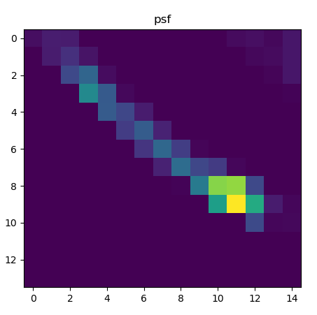
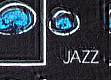

# Python deconvolution example

First install dependencies with

	pip install numpy scikit-image matplotlib
	
and then run

	python deconv.py jazz.png psf5.png 0.0025

*The point spread function (PSF).*

*Input image (left) and deconvolution output (middle) and clipped output (right.)*

